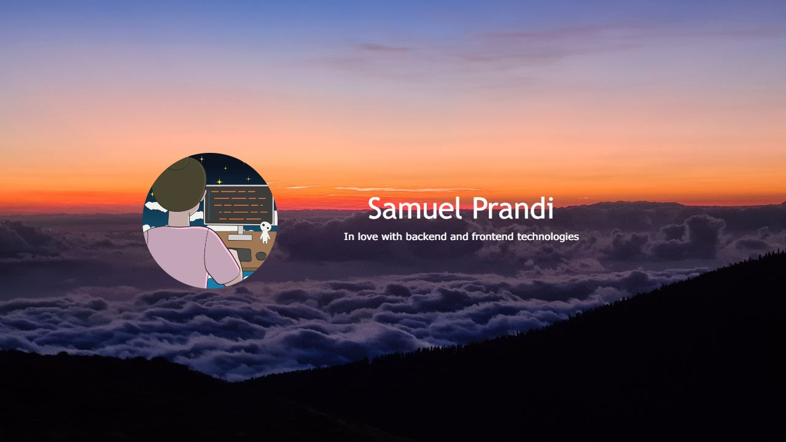

<p>I'm a self-taught developer with a passion for web programming. My goal is to offer a responsive, accessible, dynamic and mantainable websites to enhance the user experience. I try to learn something new every day to discover new ways to achieve the best solution</p>

##

<br>

```java
import java.util.Scanner;

public class JobSearch {

    public static void main(String[] args) {
        boolean lookingForJob = true;
        Scanner scanner = new Scanner(System.in);

        while (lookingForJob) {
            System.out.println("Hey there! I'm looking for a job!");
            System.out.print("Are you interested in hiring me? (yes/no): ");
            String userInput = scanner.nextLine().toLowerCase();

            if (userInput.equals("yes")) {
                lookingForJob = false;
                System.out.println("Thank you for hiring me! I appreciate the opportunity.");
            }
        }

        scanner.close();
    }
}

```

<br>

<picture>
  <source media="(prefers-color-scheme: dark)" srcset="coding_dark.gif">
  
</picture>

<br>


- 🔭 I’m currently studying on **becoming a frontend web developer**.

- 🌱 I’m currently learning **React**.

- 👯 I’m looking to collaborate on **developing new open-source projects**.

- 🤔 I’m looking for help with **React**.

- 💬 Ask me about **HTML, CSS, JavaScript, Java**.

- 📫 How to reach me: **prandisamuel99@gmail.com**.

- 🔍 Take a look at my projects on [**Frontend Mentor**](https://www.frontendmentor.io/profile/JustANipple)!.

<br>
<br>


## 🏆 Goals

- 📓 Build a personal portfolio to share my projects
- 🌐 Complete all frontendmentor challenges
- 🎓 Build a Linkedin profile to share my work and who i am
- 🚀 Gain experience in creating reusable components using **React**.
- 🌐 Improve my knowledge of web accessibility standards and incorporate them into my projects.
- 🎨 Learn new design techniques and tools to enhance my UI/UX design skills.

<br>

## 🎯 Future Goals

- ☠️ Learn about cybersecurity to build knowledge about systems vulnerabilities
- 🧱 Build a project with a team to provide an innovative service
- 🦾 Make projects to automate repetitive manual tasks
- 🧠 Study the fundamentals of **Artificial Intelligence** and its various subfields.
- 🌟 Share my knowledge and experience by mentoring others in the tech community.

<br>

## 📈 Achievements

- 💧 I have successfully built a program in Java that help farmers reduce water consuption in tomato, potato and onion fields
- 📚 I have completed the entire mooc.fi interactive Java course to learn my first programming language
- 📚 I have completed both HTML, CSS and JavaScript interactive course on official MDN site
- 👌 I have submitted over 20 coding challenges on both codewars and leetcode
- 🎉 I have successfully completed over 40 projects on Frontend Mentor and shared my code with others.
- 🤝 I have provided feedback on projects on Frontend Mentor website.

#

<br>

<h2 align="center">📫 Connect with me</h2>

<div align = "center">
    
[](mailto:prandisamuel99@gmail.com)&nbsp;
[](https://www.frontendmentor.io/profile/JustANipple)&nbsp;

<br>

<div align = "center">

<h2 align="center">🛠️ Languages and Tools</h2>

<details open>
<summary><b>🏄‍♂️ Frontend</b></summary>
<br>
  
&nbsp;
&nbsp;
&nbsp;
&nbsp;
&nbsp;


</details>

<details open>
<summary><b>🧰 Backend</b></summary>
<br>
  

&nbsp;

</details>

<details open>
<summary><b>💻 Software and Tools</b></summary>
<br>

&nbsp;
&nbsp;
&nbsp;
&nbsp;
</details>

<details open>
<summary><b>🤖 Artificial Intelligence and Bots</b></summary>
<br>
  

</details>

</div>
